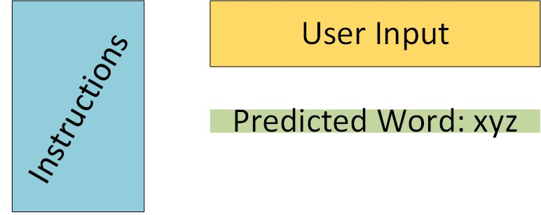

This post marks the start of a series which builds a basic word prediction model using R. The series would be divided into 5 parts as follows:

Part 1 - Figuring out the problem at hand

Part 2 - Exploring the dataset 

Part 3 - Creating the model

Part 4 - Deploying the model

Part 5 - Conclusion and future scope for improvement

---

So, welcome to Part 1 of the NLP series where we build a word prediction model using R.

In this post, we will be planning some of the aspects of our project. As a result, <span style="color:green">*this post might be quite wordy and would not involve programming.*</span> But, this kind of planning is probably one of the most important steps as this is where we figure out the goals and  expectations from the project. So, in this part of the series, we would discuss about the problem at hand and fix some parameters for the project like the kind of model that we would use, the platform where we would deploy, possible problems we could encounter, etc. In practice, this kind of planning would be done in a meeting in the presence of your team members. 

## 1. Figuring out the problem 

Ok. So we need to build a program to predict the next word based on the words that a user has typed. This would basically be like most of the modern word predictors in our phones. Here are the goals for our project

- The target user would be a person who frequently types messages, emails, tweets, etc and uses the modern/current form of the english language. This basically means we don't want the predictor to predict words like "thou" or convert normal english to leetspeak like 3ngl!sh. 

- The app should be fast and should require less memory.

- The user interface should be basic and uncomplicated so that it can be used by anybody who knows how to type on a keyboard. 


## 2. Data Collection

The data would heavily influence this problem as the model which we train will output words based on the vernacular used in the dataset. For example, if we were to present this application to a person who writes Shakespearean english, we would need to use a corpus which would have text written in Shakespearean english. In this case, we are targetting users who use normal day-to-day english language. So, a corpus containing text from blog posts, news articles, tweets, etc should work well. Such corpus would be easy to aquire for free as most of the popular text mining libraries like [NLTK](https://www.nltk.org/) and [tm](https://cran.r-project.org/web/packages/tm/tm.pdf) include some corpora and training models. I have used the Swiftkey dataset which contains text files of blogs, news and tweets in this project. But the user can use any corpus which is written in modern english. 

## 3. The model to be used

The most suitable model in this case would be using the [n-gram](https://en.wikipedia.org/wiki/N-gram) model with [Katz's Backoff](https://en.wikipedia.org/wiki/Katz%27s_back-off_model) to predict the next word.

### **3.1 What are n-grams?**

n-grams are phrases which are formed by splitting a sentence into groups of 'n' words. For example, consider the sentence below

```
I am really excited for the new stormlight archive book.
```

The 3-grams or trigrams for this sentence would be:

```
"I am really"
"am really excited"
"really excited for"
.
.
.
"stormlight archive book"
```

### **3.2 Katz's Backoff**

Katz's Backoff is an algorithm which says that if we don't find the exact phrase in our list of n-grams, then search for in the the list of (n-1)-grams. The n-gram phrases are arranged according to their frequency of occurences and the output would be the most common phrase in the list containing the words in that exact order. This means if the user has entered the phrase
```
My name
```
and there is no phrase which resembles "my name ____" in our 3-gram list, then check for the phrase "name ___" in our 2-grams list. 

This means we would have to maintain multiple lists of n-gram phrases. 

<span style="color:red"> *This would probably require lots of storage and might cause problems in deployment.*</span>

To avoid this, we would only keep the n-grams which occur more than a certain number of times. We can decide while training the model based on the kinds of phrases the model covers.

## 4. Model deployment 

R has a pretty solid deployment offering in the form of [Shiny](https://www.analyticsvidhya.com/blog/2016/10/creating-interactive-data-visualization-using-shiny-app-in-r-with-examples/). It can be used to deploy a simple app on web without the knowledge of HTML, CSS or Javascript for free. This means we are fine as long as we know R. The app can be reactive i.e. the next word can be displayed without the need of pressing a button or creating a distinct event. This would make the app easy to use. The basic design can be as shown in the figure below.




---
Now that we have laid out the plan, we can move on to writing the code and creating the model.

Let's move on to PART 2 where we will start creating the model.