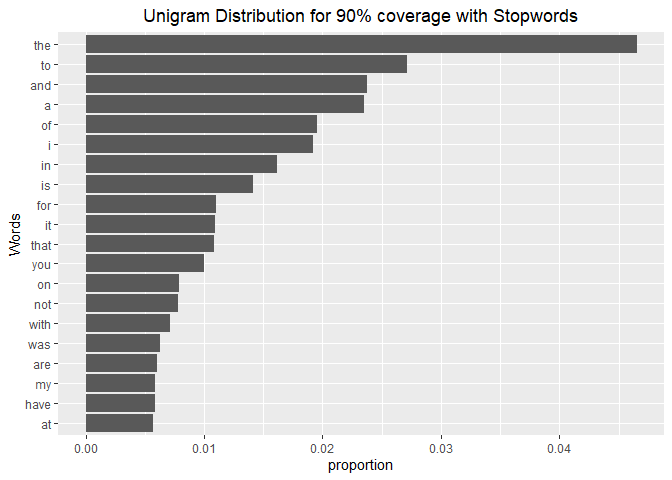
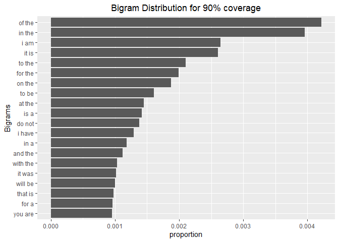

This is the second post in a series which builds a basic word prediction model using R. We will be doing some basic EDA and figure out where we might run into problems during the modelling and deployment stages. Given below are the links to all the parts in the series:

[Part 1 - Figuring out the problem at hand](https://shounakshastri.github.io/NLP/Word%20Prediction%20Model%20-%20PART%201%20-%20Figuring%20out%20the%20problem%20at%20hand)

Part 2 - Exploring the dataset 

Part 3 - Creating the model

Part 4 - Deploying the model

Part 5 - Conclusion and future scope for improvement

## Introduction

This report summarizes the Exploratory Data Analysis performed on a text dataset. I have used the Swiftkey dataset containing blogs, news articles and tweets in this exercise. But, any corpus containing articles, messages or posts can be used here. The steps would be similar.

This analysis will help us plan the development of an app which would predict the next word in a sentence like the autocomplete feature in most mobile phones.

I have already downloaded the corpus while testing. So, here we will directly import the data and start doing some analysis.

## Initial set up

First we read the data into separate variables and close the connections to save memory.


```r
# Import all the files and open the connection
fileBlogs <- file(".\\final\\en_US\\en_US.blogs.txt", "rb")
fileNews <- file(".\\final\\en_US\\en_US.news.txt", "rb")
fileTweets <- file(".\\final\\en_US\\en_US.twitter.txt", "rb")

# Read the lines and close the connections
blogs <- readLines(fileBlogs, encoding = "UTF-8", skipNul = TRUE)
close(fileBlogs)
rm(fileBlogs)

news <- readLines(fileNews, encoding = "UTF-8", skipNul = TRUE)
close(fileNews)
rm( fileNews)

tweets <- readLines(fileTweets, encoding = "UTF-8", skipNul = TRUE)
close(fileTweets)
rm(fileTweets)
```


Let's see what the data looks like. We will print the first 3 rows from all three files. I ran this code in RStudio, so I can see the length of `blogs`, `news` and `tweets` directly in the environment tab. But, in case you do not have access to the environment tab, `length()` would work just fine. 

### Blogs

```
## [1] "In the years thereafter, most of the Oil fields and platforms were named after pagan “gods”."                                                           
## [2] "We love you Mr. Brown."                                                     
## [3] "Chad has been awesome with the kids and holding down the fort while I work later than usual! The kids have been busy together playing Skylander on the XBox together, after Kyan cashed in his $$$ from his piggy bank. He wanted that game so bad and used his gift card from his birthday he has been saving and the money to get it (he never taps into that thing either, that is how we know he wanted it so bad). We made him count all of his money to make sure that he had enough! It was very cute to watch his reaction when he realized he did! He also does a very good job of letting Lola feel like she is playing too, by letting her switch out the characters! She loves it almost as much as him."
```

### News

```
## [1] "He wasn't home alone, apparently."                                                                                                                                                
## [2] "The St. Louis plant had to close. It would die of old age. Workers had been making cars there since the onset of mass automotive production in the 1920s."                        
## [3] "WSU's plans quickly became a hot topic on local online sites. Though most people applauded plans for the new biomedical center, many deplored the potential loss of the building."
```

### Tweets

```
## [1] "How are you? Btw thanks for the RT. You gonna be in DC anytime soon? Love to see you. Been way, way too long."  
## [2] "When you meet someone special... you'll know. Your heart will beat more rapidly and you'll smile for no reason."
## [3] "they've decided its more fun if I don't."
```

Now by looking at the blogs, news and tweets, we can say that out of the three files, `news` is most likely to have more formal language and `tweets` is most likely to have an informal language. It probably won't affect the final application because we will be cleaning the data before training, but it's a good observation to make to distinguish between the three files.

## Basic summary of the data

First, let's check the memory utilization by the individual files in order to get some perspective about the space requirements. We will also run the garbage collector using `gc()` everytime we remove some big variables to free up some space for R. .

```r
blogsMem <- object.size(blogs)
format(blogsMem, units = "MB", standard = "legacy")

newsMem <- object.size(news)
format(newsMem, units = "MB", standard = "legacy")

twetsMem <- object.size(tweets)
format(tweetsMem, units = "MB", standard = "legacy")

totalMem <- blogsMem + newsMem + tweetsMem
format(totalMem, units = "MB", standard = "legacy")

rm(blogsMem, newsMem, tweetsMem, totalMem)
gc() # Garbage Collector
```


```
## [1] "255.4 Mb"
## [1] "257.3 Mb"
## [1] "319 Mb"
## [1] "831.7 Mb"
```

```
##            used  (Mb) gc trigger   (Mb)  max used  (Mb)
## Ncells  6073223 324.4   10069276  537.8   7193414 384.2
## Vcells 91950759 701.6  134225621 1024.1 105237031 802.9
```
So, the dataset needs about 832MB of memory to store in the current state. This might create some problems while creating the application as the shiny website only provides 1Gb of space for the app data. Anything above that would require a purchase of premium plans.  We did hint this in PART 1 of this series but, looking at this analysis, it is 
clear that it would be better if we design the app to use lesser space.

Now, lets check some basic stats regarding the text in the three files. In this case, `nlines` represents the number of lines in the file, `nwords` represents the number of words in the file and `longestLine` represents the number of characters in the longest line in the file.

```
##   fileType  nlines   nwords longestLine
## 1    blogs  899288 37334131       40833
## 2     news 1010242 34372530       11384
## 3  twitter 2360148 30373583         140
```

It should be noted here that the longest line in the twitter file are 140 characters in length. This is accurate as twiter used to limits all the tweets to 140 characters. Atleast this was the case a few years back. 

It can also be observed here that, even though the twitter dataset is largest in terms of number of lines and memory required, the number of words is much less than that in blogs. This indicates a usage of shorter senteneces or, more probably, special characters like emojis. <span style='color: green'>*This information would be important during the data cleaning because now we would have to look out for alphanumeric characters as well.*</span>

## Cleaning and Sampling the data 

In this section, we will clean the data and create smaller samples so that it is easier to work on. The cleaning process will involve the following steps:
 - expanding contractions
 - converting all characters to lowercase
 - removing digits and words containing digits
 - removing punctuations

### Converting the files to tibbles (basic data frames)


```r
blogs <- tibble(text = blogs)
news <- tibble(text = news)
tweets <- tibble(text = tweets)
```

### Combining the data and creating samples

Here, we first combine all the three dataframes into one and then sample from that text. This combination is done by using the `bind_rows()` function. This is done so that when we create a sample, it would randomly pick rows from all three data frames combined.


```r
corpus <- bind_rows(blogs, news, tweets)
rm(blogs, news, tweets)
gc()
```

```
##            used  (Mb) gc trigger   (Mb)  max used  (Mb)
## Ncells  6081596 324.8   12179517  650.5  12179517 650.5
## Vcells 91969249 701.7  161150745 1229.5 114036139 870.1
```

#### *Creating a sample*

Now we will create a sample from the combined data and operate on that. This would give us a good approximation while making the code faster as we don't have to use the complete dataset. The `set.seed()` line should be uncommented for reproducability. Also, from this point on, we will be operating on the sample, so we will remove the original dataset to free up some memory.


```r
set.seed(5)
corpusSample <- corpus[sample(nrow(corpus), 50000), ]
rm(corpus)
```

## Tidying the sample dataset

Here we will remove all the contractions, numbers, punctuation, special characters and emoticons from the sample. We use regex to detect the patterns.


```r
corpusSample$text <- tolower(corpusSample$text) # Convert everything to lowercase
corpusSample$text <- replace_contraction(corpusSample$text)
corpusSample$text <- gsub("\\d", "", corpusSample$text) # Remove Numbers
corpusSample$text <- gsub("[^\x01-\x7F]", "", corpusSample$text) # Remove emoticons
corpusSample$text <- gsub("[^[:alnum:]]", " ", corpusSample$text) # Remove special characters. Adds extra spaces
corpusSample$text <- gsub("\\s+", " ", corpusSample$text) # Remove the extra spaces
```

## Tokenizing the sample

Tokenizing converts strings into list of words. Here, we will create two sets of tidy data, one which includes all the stopwords and the other with stopwords removed. Stopwords is a list of words commonly used in the English language which are usually removed from the text while implementing text mining applications. Although removing the stopwords would reduce the load on our system significantly, it is not advisable to do so in the case of our target application as discussed in Part 1. That is because the text predictor should be able to predict words included in the list. But we wil check the effect of removing the stop words on our dictionary anyways to satisfy my personal curiosity.


```r
tidyset_withStopWords <- corpusSample %>%
    unnest_tokens(word, text)

data("stop_words")
tidyset_withoutStopWords <- corpusSample %>%
    unnest_tokens(word, text) %>%
    anti_join(stop_words)
```

Lets see how many unique words are there in both sets


```r
keyWithStopwords <- unique(tidyset_withStopWords)
keyWithoutStopwords <- unique(tidyset_withoutStopWords)
dim(keyWithStopwords)
```

```
## [1] 54895     1
```

```r
dim(keyWithoutStopwords)
```

```
## [1] 54237     1
```
This means our dictionary is reduced by about 1%. The change is not that drastic. Anyways, on to the job at hand...

## Observations from the EDA

How many tokens can be used to cover half of all the words in the sample?


```r
coverage50pctWithStopwords <- tidyset_withStopWords %>%
    count(word) %>%  
    mutate(proportion = n / sum(n)) %>%
    arrange(desc(proportion)) %>%  
    mutate(coverage = cumsum(proportion)) %>%
    filter(coverage <= 0.5)
nrow(coverage50pctWithStopwords)
```

```
## [1] 122
```


How many tokens can be used to cover 90% of all the words in the sample?


```r
coverage90pctWithStopwords <- tidyset_withStopWords %>%
    count(word) %>%  
    mutate(proportion = n / sum(n)) %>%
    arrange(desc(proportion)) %>%  
    mutate(coverage = cumsum(proportion)) %>%
    filter(coverage <= 0.9)
nrow(coverage90pctWithStopwords)
```

```
## [1] 6667
```

### Plotting the distributions

Here we display the plots for uni, bi and trigrams for the sample.

#### *Unigrams*


```r
coverage90pctWithStopwords %>%
    top_n(20, proportion) %>%
    mutate(word = reorder(word, proportion)) %>%
    ggplot(aes(word, proportion)) +
    geom_col() +
    xlab("Words") +
    ggtitle("Unigram Distribution for 90% coverage with Stopwords")+
    theme(plot.title = element_text(hjust = 0.5))+
    coord_flip()
```

<!-- -->

```r
rm(tidyset_withStopWords,
   keyWithStopwords, 
   coverage50pctWithStopwords,
   coverage90pctWithStopwords)
```

#### *Bigrams*


```r
tidyset_withStopWords <- corpusSample %>%
    unnest_tokens(bigram, text, token = "ngrams", n = 2)


coverage90pctWithStopwords <- tidyset_withStopWords %>%
    count(bigram) %>%  
    mutate(proportion = n / sum(n)) %>%
    arrange(desc(proportion)) %>%  
    mutate(coverage = cumsum(proportion)) %>%
    filter(coverage <= 0.9)

coverage90pctWithStopwords %>%
    top_n(20, proportion) %>%
    mutate(bigram = reorder(bigram, proportion)) %>%
    ggplot(aes(bigram, proportion)) +
    geom_col() +
    xlab("Bigrams") +
    ggtitle("Bigram Distribution for 90% coverage")+
    theme(plot.title = element_text(hjust = 0.5))+
    coord_flip()
```

<!-- -->

```r
rm(tidyset_withStopWords, 
   coverage90pctWithStopwords)
```


#### *Trigrams*


```r
tidyset_withStopWords <- corpusSample %>%
    unnest_tokens(trigram, text, token = "ngrams", n = 3)


coverage90pctWithStopwords <- tidyset_withStopWords %>%
    count(trigram) %>%  
    mutate(proportion = n / sum(n)) %>%
    arrange(desc(proportion)) %>%  
    mutate(coverage = cumsum(proportion)) %>%
    filter(coverage <= 0.9)

coverage90pctWithStopwords %>%
    top_n(20, proportion) %>%
    mutate(trigram = reorder(trigram, proportion)) %>%
    ggplot(aes(trigram, proportion)) +
    geom_col() +
    xlab("Trigrams") +
    ggtitle("Trigram Distribution for 90% coverage")+
    theme(plot.title = element_text(hjust = 0.5))+
    coord_flip()
```

<!-- -->

```r
rm(tidyset_withStopWords, 
   coverage90pctWithStopwords)
```

This gives us a fair idea about the data. Now we can proceed to build the model.
